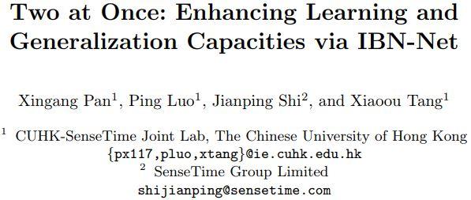
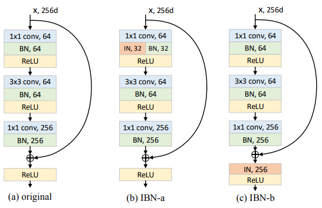

# IBN-Net.mxnet
A MXNet implementation of IBN-Net (Resnet-IBN-a, Resnext-IBN-a, Resnext-IBN-b).  
(**Resnet-IBN-a 50,101,152, Resnext-IBN-a 50,101,152, Resnext-IBN-b 50,101,152**)

This is a [MXNet](http://mxnet.io/) implementation of IBN-Net (**Resnet-IBN-a 50,101,152**) architecture as described in the paper [Two at Once: Enhancing Learning and Generalization Capacities via IBN-Net](https://arxiv.org/pdf/1807.09441.pdf) proposed by [Xingang Pan](https://github.com/XingangPan), Ping Luo, Jianping Shi, and Xiaoou Tang. This paper is accepted by ECCV 2018. They won the 1st place on the WAD 2018 Challenge Drivable Area track with this IBN-Net block.

The author's pytorch implementation can be found in his [repo](https://github.com/XingangPan/IBN-Net) on GitHub.

This is an illustration of a Instance-batch normalization (IBN) block.

 

The Resnet-IBN-a is implemented according to the (b) IBN-a. Please note, our Resnet implementation is followed "Identity Mappings in Deep Residual Networks",[resnet-v2](https://arxiv.org/abs/1603.05027v3). It is slightly different than author's pytorch version [resnet-v1](https://arxiv.org/abs/1512.03385v1).

The Resnext-IBN-b is implemented according to the (c) IBN-b.

As the name implies, batch normalization [(BN)](https://arxiv.org/abs/1502.03167v3) and instance normalization [(IN)](https://arxiv.org/abs/1701.02096v2) are carefully unified in a single deep architecture.

We modified resnext architecture as illustrated in following paper
Jie Hu, Li Shen, Gang Sun. ["Squeeze-and-Excitation Networks"] (https://arxiv.org/pdf/1709.01507v1.pdf)

(a) The first 7x7 convoluational layer was replaced with three consecutive 3x3 convolutional layers.

(b) The down-sampling projection 1x1 with stride-2 convolution was replaced with a 3x3 stride-2 convolution to preserve information.

(c) A dropout layer (with a drop ratio of 0.2) was inserted before the classifier layer to prevent overfitting.

(d) Label-smoothing regularization (as introduced in Christian Szegedy et. al. ["Rethinking the Inception Architecture for Computer Vision"](https://arxiv.org/pdf/1512.00567v3.pdf)) was used during training.

So we called it as **resnext_w_d_v2**

## Requirements

Install MXNet(1.0.0) on GPUs mechine with NVIDIA CUDA 8.0, and it's better also installed with [cuDNN v6](https://developer.nvidia.com/cudnn) or later version (I'm not testing cuDNN v7).

## Data

ImageNet'12 dataset

Imagenet 1000 class dataset with 1.2 million images. Because this dataset is about 120GB, so you have to download by yourself. Sorry for this inconvenience.

## How to Train

For data preparation, you can refer [my pervious part of densenet](https://github.com/bruinxiong/densenet.mxnet) or you can also visit the repo of [Wei Wu](https://github.com/tornadomeet/ResNet). In his page, there is a very detailed information about how to prepare your data. 

When you finised data preparation, please make sure the data locates the same folder of source codes. You also need to change path of path_imgrec in line 128 and line 152 of train_resnet_ibn.py. Then you can run the training cmd just like this (here, I use 4 gpus for training):

python -u train_resnet_ibn.py --data-dir data/imagenet --data-type imagenet --depth 50 --batch-size 256 --gpus=0,1,2,3

Maybe you should change batch-size from 256 to 128 due to the memory size of GPU.

## How to retrain

When we want to train the large dataset and hope to change learning rate manually, or the machine is suddenly shutdown due to some reason, of course, we definitely hope we can continue to train model with previous trained weights. Then, your can use this cmd:

python -u train_resnet_ibn.py --data-dir data/imagenet --data-type imagenet --depth 50 --batch-size 256 --gpus=0,1,2,3 --model-load-epoch=50 --lr 0.001 --retrain

This means you can retrain your resnet_ibn_a model from epoch 50 and change lr=0.001 using 4 GPUs.

## Training curves

The training procedure is ongoing. So, I hope anyone who are mxnet fun can test this code with me. When I finish, I will update more information about training and validation.

## Pretrained model

## TO DO LIST

**SE-Resnet-IBN-a 50, 101, 152**.

**Densenet-IBN-a 169**.

## Reference

[1]  Kaiming He, Xiangyu Zhang, Shaoqing Ren, Jian Sun. ["Identity Mappings in Deep Residual Networks"](https://arxiv.org/abs/1603.05027v3)

[2]  Sergey Ioffe, Christian Szegedy. ["Batch Normalization: Accelerating Deep Network Training by Reducing Internal Covariate Shift"](https://arxiv.org/abs/1502.03167v3)

[3]  Dmitry Ulyanov, Andrea Vedaldi, Victor Lempitsky. ["Improved Texture Networks: Maximizing Quality and Diversity in Feed-forward Stylization and Texture Synthesis"](https://arxiv.org/abs/1701.02096v2)

[4]  Dmitry Ulyanov, Andrea Vedaldi, Victor Lempitsky. ["Instance Normalization: The Missing Ingredient for Fast Stylization"](https://arxiv.org/abs/1607.08022v3)

[5] [PyTorch implementation](https://github.com/XingangPan/IBN-Net/blob/master/models/imagenet/resnet_ibn_a.py)

[6]  Saining Xie, Ross Girshick, Piotr Dollar, Zhuowen Tu, and Kaiming He. ["Aggregated Residual Transformations for Deep Neural Networks"](https://arxiv.org/pdf/1611.05431v2.pdf)

[7]  Kaiming He, Xiangyu Zhang, Shaoqing Ren, and Jian Sun. ["Deep Residual Learning for Image Recognition"](https://arxiv.org/pdf/1512.03385v1.pdf)

[8]  Jie Hu, Li Shen, and Gang Sun. ["Squeeze-and-Excitation Networks"](https://arxiv.org/pdf/1709.01507.pdf)

[9]  Xiangang Pan, Ping Luo, Jianping Shi, and Xiaoou Tang. ["Two at Once: Enhancing Learning and Generalization Capacities via IBN-Net"](https://arxiv.org/pdf/1807.09441.pdf)
